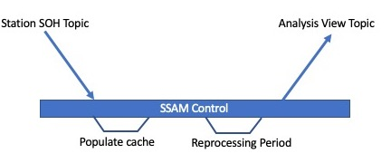
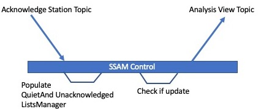
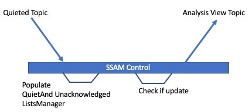
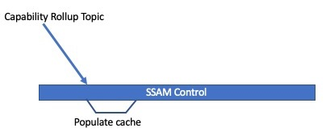

# Kafka Topic Events

## Kafka Topics Subscribed
* soh.station-soh
* soh.ack-station-soh
* soh.quieted-list
* soh.capability-rollup

## Kafka Topics Published
* soh.ui-materialized-view

## Expected Behavior
A single flux is used to listen for station soh objects.  
Soh objects are cached and published to the 
soh.ui-materialized-view topic every processing period.

A single flux listens for acknowledged soh status changes.
This triggers a publish to the soh.ui-materialized-view 
if the station exists in the cache.

A single flux listens for quieted soh status changes.
This triggers a publish to the soh.ui-materialized-view 
if the station exists in the cache.

A single flux listens for soh capability rollups.  
Rollups are cached. 

