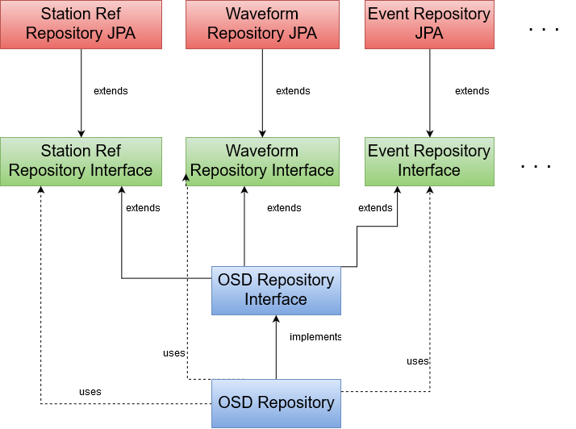

# Purpose

The GMS Object Storage and Distribution (OSD) mechanism is used to represent, transmit, and store objects representing domain information for GMS.  

# Goals

1. **Uniform abstraction and usage**: interaction with the OSD occurs through well-defined code-level abstractions (Java interfaces).  The caller should not need to deal with underlying details such as transport mechanism (e.g. HTTP) or storage layer (e.g. SQL).  This abstraction also covers the means in which the caller communicates with the OSD, i.e. the interface is the same even when the transport means varies (such as service communication versus direct database communication).
2. **Support centralized rules that cross-cut domain entities** such as atomically storing an event with it's associated signal detections.  This simplifies the work applications would have to do to save data correctly if they were only provided more primitive operations.
3. **Allow client applications to be coded against a slice of the OSD API where appropriate**, for example, provide data acquisition components an interface that doesn't e.g. have a means of storing events.
4. **Support polyglot OSD usage** by exposing OSD functionality through a service API.  Other components in the system like the User Interface suite require this and it is also desirable for extensibility purposes.
5. **Make the OSD interfaces for Java match the service API one-to-one.**  This makes it easier to refactor OSD (service) API's since the Java users of those API's now have a code dependency.  Other components like the API gateway may get this benefit also if they're using generated clients (via swagger-codegen).

## Non-goals

1. Provide an ability to change how any or all clients communicate with the OSD (e.g. database vs service calls) **without code changes**; code would change to instantiate different implementation of interfaces, most code does remain unchanged though (coded against interfaces, not implementations).

# Structure

## `frameworks-osd-commonobjects`

Defines the Common Object Interface (COI) objects for GMS.  These objects are what are sent/received in all OSD operations.

## `frameworks-osd-api`

Defines the OSD interfaces.  The interfaces have a relationship to each other similar to this:

The interfaces in green are 'narrow' OSD interfaces for a particular area of the GMS domain.  These interfaces are annotated with JAX-RS annotations to generate service documentation.  The interfaces in red implement the 'narrow' OSD interfaces by communicating with a database using the [Java Persistence Api](https://en.wikipedia.org/wiki/Java_Persistence_API) (JPA); note these implementations actually live in `frameworks-osd-repository`.  The OSD Repository Interface is a 'collecting interface' that extends all of the 'narrow' OSD interfaces and adds any additional methods that cross-cut those interfaces.  The OSD Repository is an implementation of this 'collecting' interface that uses the JPA implementations to delegate functionality or does custom database work as needed (e.g. store events and signal detections in a single atomic transaction); note this component actually lives in `frameworks-osd-repository`.

This structure allows a few advantages:
  - The 'narrow' OSD interfaces and their implementations can (at least somewhat) be independently developed
  - Client applications can be coded against the 'narrow' OSD interfaces and thus see closer to just the set of operations they actually use
  - Cross-cutting operations are supported so that they can implemented correctly, efficiently, and only once

## `frameworks-osd-repository`

Contains implementations of the OSD interfaces (both 'narrow' and 'collecting'), which use storage technologies such as [JPA](https://en.wikipedia.org/wiki/Java_Persistence_API)/[Hibernate](https://en.wikipedia.org/wiki/Hibernate_(framework)) to store and retrieve COI objects.

## `frameworks-osd-daos`

Contains an implementation of the 'collecting' OSD Repository interface.

## `frameworks-osd-service`

Runnable application that executes `frameworks-osd-repository` as an HTTP service.